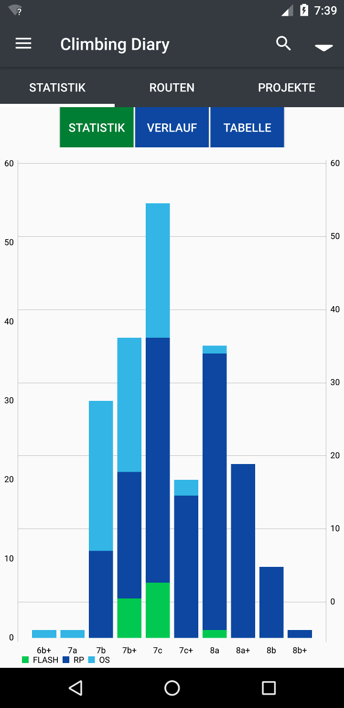
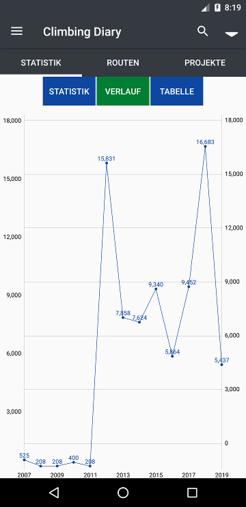
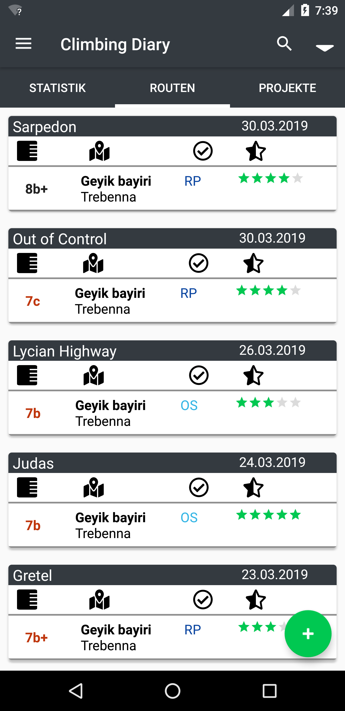
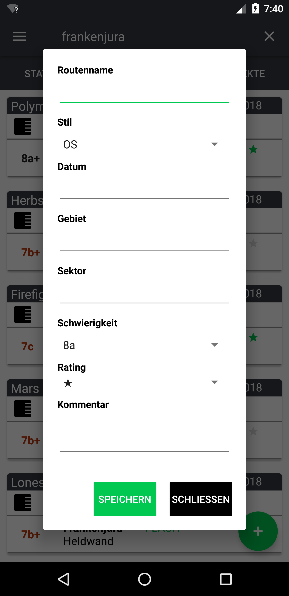

Repsository für die Entwicklung der **Android-App** der gleichnamigen [Desktop-App](https://github.com/LorenMucha/Climbing-Diary). 
Die Anwendung befindet sich noch in der Entwicklungsphase und soll dem Nutzer alle Funktionen der Desktop Anwendung mit Synchronisierung bieten.
#### Funktionen
- Diagramme (Verlauf- und Balkendiagramm)
- Hinzufügen, verändern, löschen von Einträgen
- Suche nach Gebieten, Routen, Graden... 
#### Preview Screenshots

